# Lacold

<p>
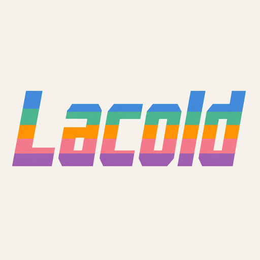
Lacold is an ink-first theme family for editors, terminals, and developer tools.
Neutral colors carry most text and interface hierarchy, restrained accents add
structure, and a fixed semantic palette keeps feedback clear.<br><br>
The first collection, <strong>Air</strong>, includes Blue, Green, Orange, Pink,
Purple, and Rainbow in independent Light and Dark palettes: twelve variants in
total.
</p>

<br clear="left">

## Preview

<p align="center">
<picture>
    <source media="(prefers-color-scheme: dark)"
            srcset="assets/screenshots/dark-air-blue.png">
    <source media="(prefers-color-scheme: light)"
            srcset="assets/screenshots/light-air-blue.png">
    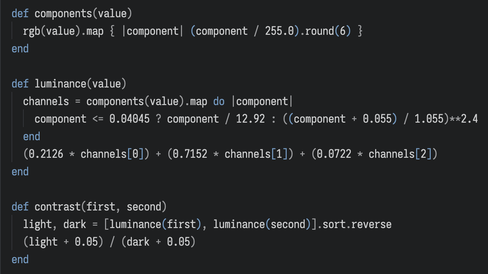
</picture>
</p>

<p align="center">
<em>Air Blue — the preview follows your GitHub appearance.</em>
</p>

<details>
<summary><strong>View all variants</strong></summary>

<br>

<table>
<thead>
    <tr>
    <th>Accent</th>
    <th>Light</th>
    <th>Dark</th>
    </tr>
</thead>
<tbody>
    <tr>
    <th>Blue</th>
    <td>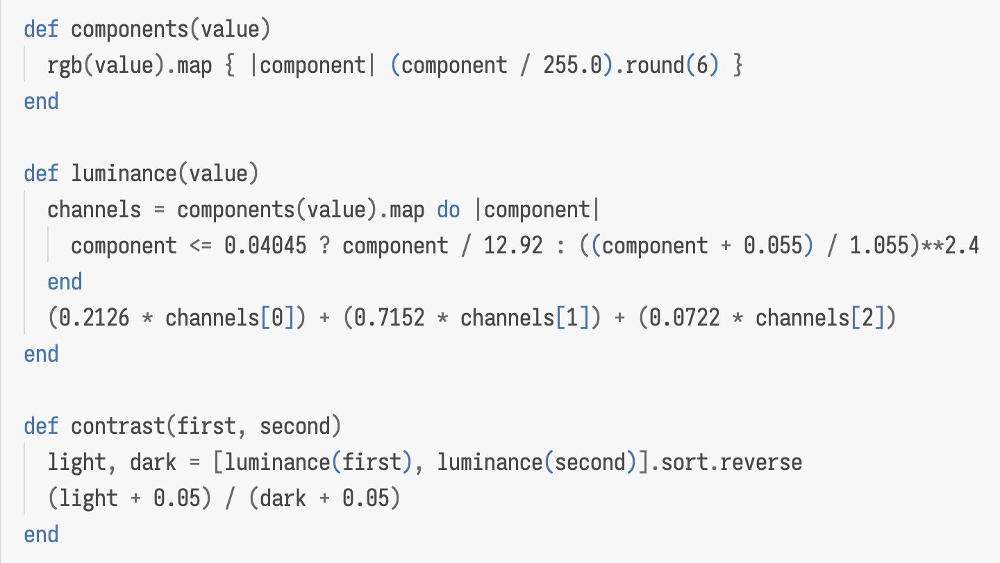</td>
    <td></td>
    </tr>
    <tr>
    <th>Green</th>
    <td>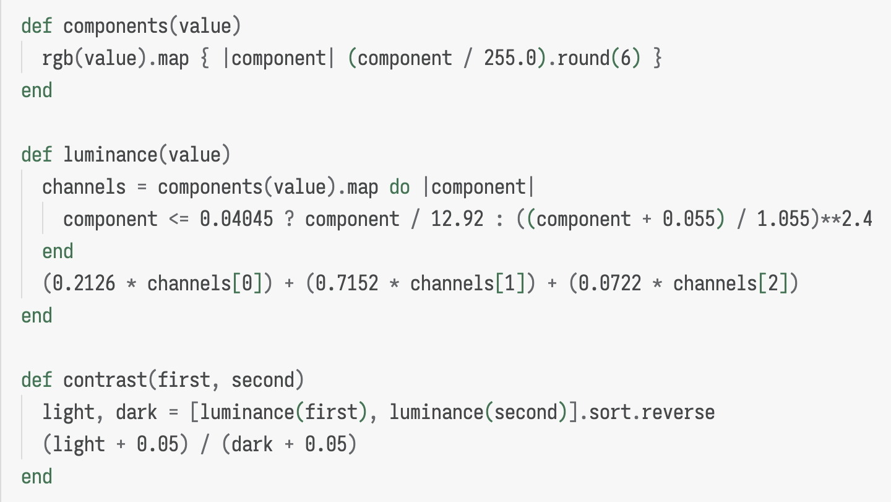</td>
    <td>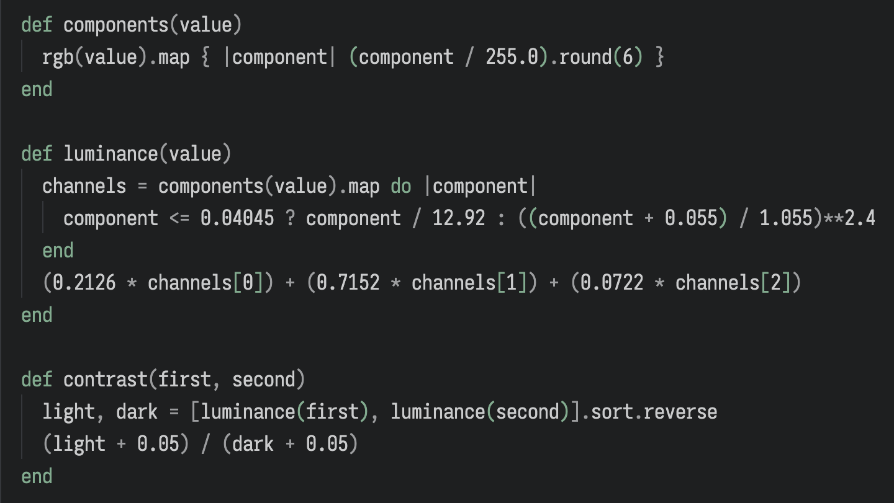</td>
    </tr>
    <tr>
    <th>Orange</th>
    <td>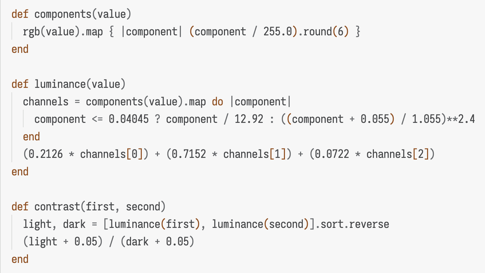</td>
    <td>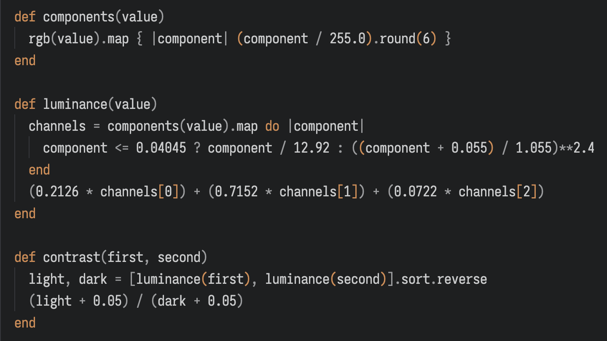</td>
    </tr>
    <tr>
    <th>Pink</th>
    <td>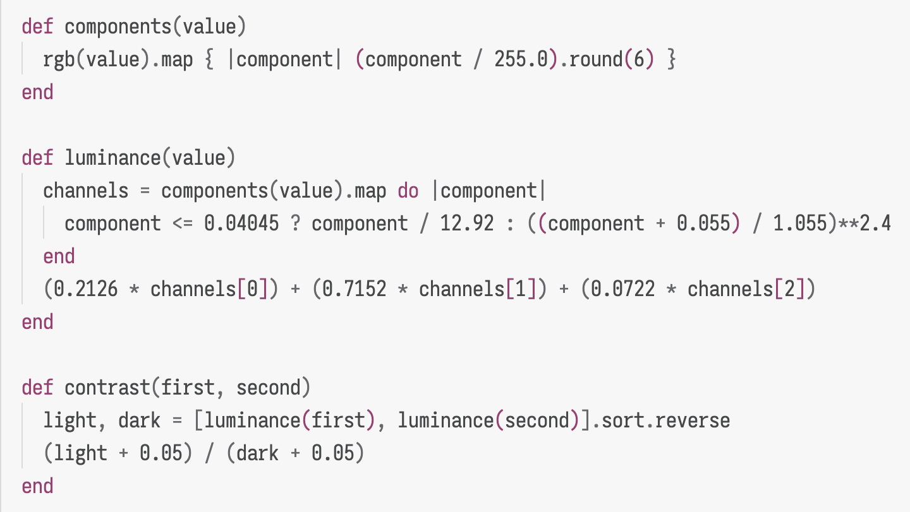</td>
    <td>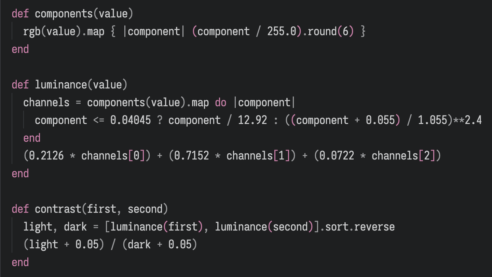</td>
    </tr>
    <tr>
    <th>Purple</th>
    <td>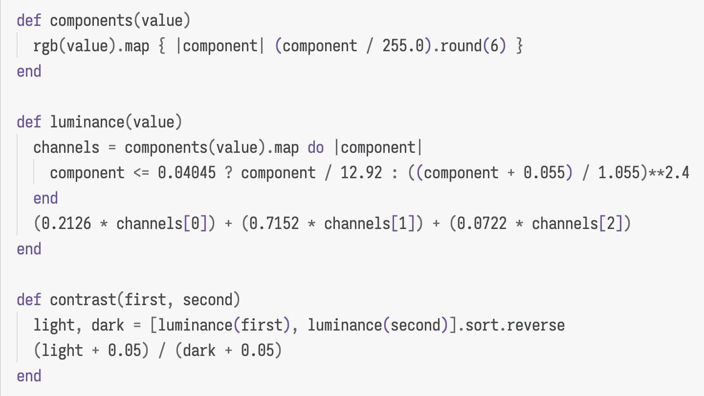</td>
    <td>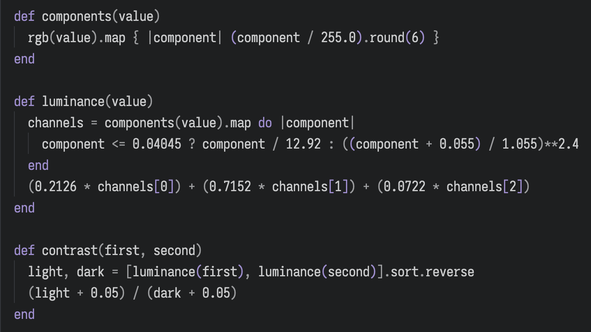</td>
    </tr>
    <tr>
    <th>Rainbow</th>
    <td>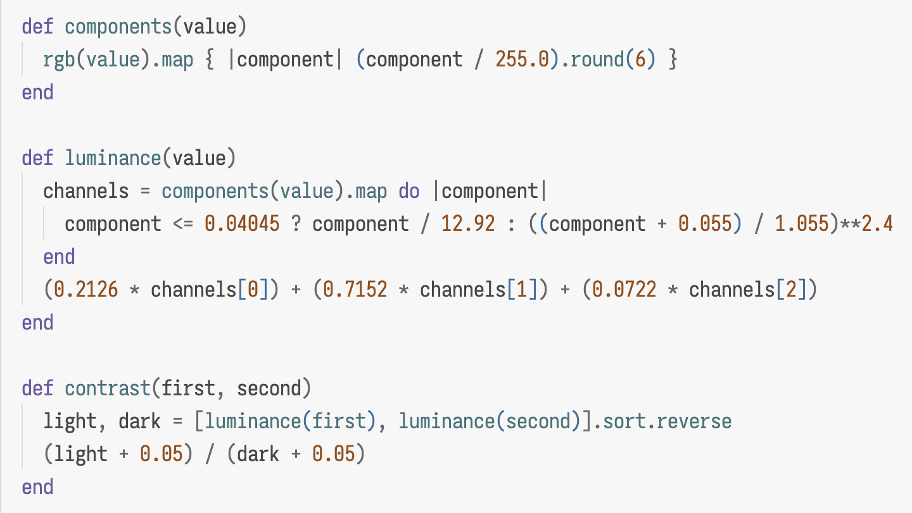</td>
    <td>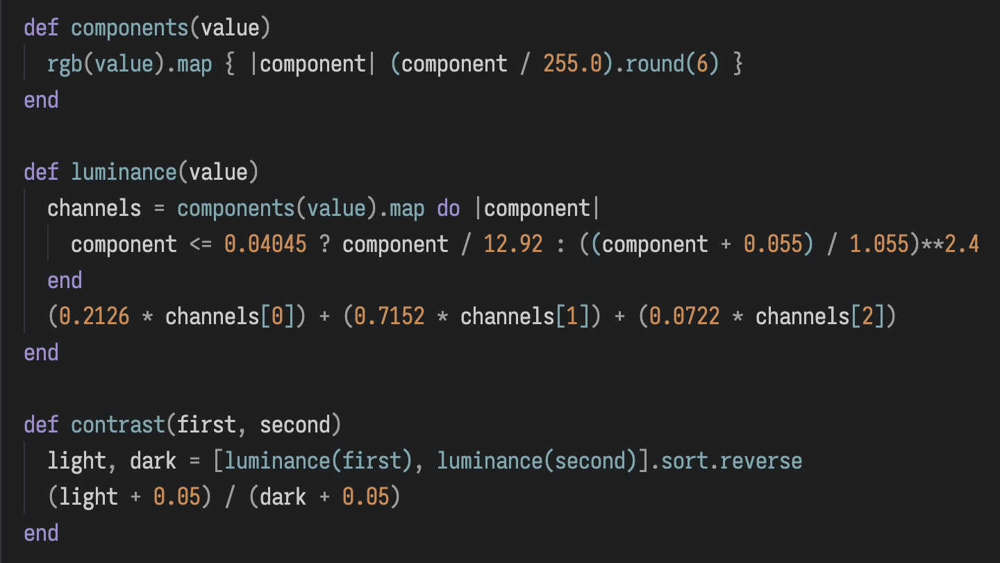</td>
    </tr>
</tbody>
</table>

</details>

## Usage

Editors: [VS Code](targets/vscode/README.md) ·
[Visual Studio](targets/visual-studio/README.md) ·
[Vim/NeoVim](targets/vim/README.md) · [Emacs](targets/emacs/README.md) ·
[IntelliJ](targets/intellij/README.md) · [Zed](targets/zed/README.md) ·
[Xcode](targets/xcode/README.md) · [CotEditor](targets/coteditor/README.md) ·
[Kate](targets/kate/README.md) · [Gedit](targets/gedit/README.md) ·
[DrRacket](targets/dr-racket/README.md)

Terminals: [Terminal.app](targets/terminal-app/README.md) ·
[iTerm2](targets/iterm2/README.md) ·
[GNOME Terminal](targets/gnome-terminal/README.md) ·
[Windows Terminal](targets/windows-terminal/README.md) ·
[Konsole](targets/konsole/README.md) · [Kitty](targets/kitty/README.md)

CLI tools: [Fish](targets/fish/README.md) · [Tmux](targets/tmux/README.md) ·
[Zellij](targets/zellij/README.md) · [bat](targets/bat/README.md) ·
[fzf](targets/fzf/README.md) · [Nano](targets/nano/README.md) ·
[BTop](targets/btop/README.md) · [Codex CLI](targets/codex/README.md) ·
[OpenCode](targets/opencode/README.md) · [Agy](targets/agy/README.md)

Vim/NeoVim, OpenCode, and iTerm2 produce adaptive Light/Dark artifacts when both
modes are selected. Kitty also produces automatic-appearance bundles.

## Design

Air keeps ordinary syntax neutral and uses authored accents for structure,
navigation, and selection. Diagnostics, diffs, search, and terminal ANSI colors
use consistent semantic roles across every variant.

Rainbow keeps the interface on a calm blue-cyan axis while its syntax uses seven
chromatic lanes plus neutral ink and gray.

## Development

Lacold requires Ruby 3.2 or newer and has no runtime gem dependencies.

```sh
bundle install
bundle exec rake check
bundle exec rake build
bundle exec rake site
```

Generated themes are written to `dist/`. Use `--output` to choose another
directory.

For a focused build, use the CLI directly:

```sh
bin/lacold list
bin/lacold build --target vim,kitty --color pink --mode dark
```

`rake check` validates palettes, contrast, generated output, manifest
completeness, and deterministic builds. The static demo is built into `_site/`.

Version tags such as `v0.1.0` create release archives, checksums, and a VSIX.
Publishing to Visual Studio Marketplace and Open VSX is enabled when the
corresponding repository credentials are configured.

## License

[MIT](LICENSE)
